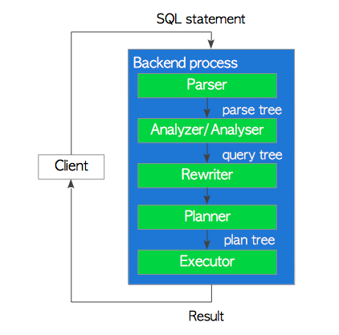
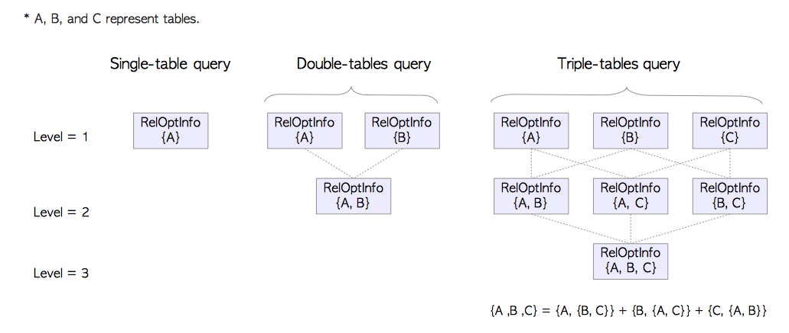

在PG的官方文档中，PostgreSQL支持SQL2011的大部分特性；查询处理是其中最复杂的子系统，并且PG的查询处理相当高效。

## Overview

尽管在9.6之后有了并行查询，但是每个连接对应的Background Worker，他都是包括五个部分：

1. Parser

   SQL->ParserTree(基于Flex，Bison实现的词法语法解析)

2. Analyzer

   对ParserTree进行语义分析，生成QueryTree

3. Rewriter

   基于定义的[规则](https://www.postgresql.org/docs/current/static/rules.html)，进行查询重写

4. Planer

   QueryTree->PlanTree；（QueryTree描述了每个节点该做什么，PlanTree描述了每个节点具体的算法，比如使用IndexScan还是SeqScan）

5. Executor

   根据PlanTree定义的顺序执行即可；（这里似乎涉及到结果是 Pull还是Push（TODO））




#### Parser

```sql
SELECT id, data FROM tbl_a WHERE id < 300 ORDER BY data;
```

##### ParseTree


该查询计划树的根是一个`SelectStmt`结构，parser只是检查语法，语法合格符合定义，就生成一个定义好的数据结构；parser不检查语义，即使table不存在，也不会提示，语义是analyzer做的；

#### Analyzer


基于ParserTree，将每个节点与数据库中的元信息对应上，TargetList就是目标列，RangeTable就是目标表，FromExpr就是From&Where，SortGroupClause。。。

#### Rewriter

> The view `pg_rules` provides access to useful information about query rewrite rules.

在pg_rules中有一些用户自定义的规则，rewriter会基于其中定义的rule以及系统的一些规则重写QueryTree;比如讲一个视图重写成一个子查询；


#### Planner&Executor

在PG中，Planner是完全基于代价估计的；它不支持基于规则和hints（PG社区不想支持hint，如果想用就用pg_hint_plan这个插件）。


每个PlanTree包括多个PlanNode，每个PlanNode包括所有Executor需要的执行信息，Executor就可以从下往上执行这个PlanTree。

每个Executor通过buffermanager来访问表和索引，并且执行的时候需要的temp_buffers（临时表）和work_mem（排序 hash算法）会提前申请好；访问tuple的时候基于MVCC的方式访问自己可见的tuple；

## SingleTable Plan

PostgreSQL的查询优化是基于代价的，代价是一个无法准确定义的值；没有一个绝对的估计，但是可以通过比较相对的性能信息；每个操作都有相应的代价估计函数；

在PostgreSQL中，有三种代价：

1. start-up：在取到第一个tuple之前的代价，比如index-scan的start-up就是读取index-page的第一个tuple之前的代价；
2. run： 获取全部的tuple的代价
3. total: 前两者的和

###### Cost of Sequential Scan example 

‘run cost’

=‘cpu run cost’+‘disk run cost’

=(cpu_tuple_cost+cpu_operator_cost)×Ntuple+seq_page_cost×Npage,

`seq_page_cost, cpu_tuple_cost, cpu_operator_cost`在postgresql.conf中定义；

Ntuple和Npage在pg_class中可以找到：

```sql
SELECT relpages, reltuples FROM pg_class WHERE relname = 'tbl';
```

###### index correlation

```sql
SELECT tablename,attname, correlation FROM pg_stats WHERE tablename = 'tablename'
```

取值从-1到1；大概就是index中的key和堆表中的key的顺序的一致性；


seq_page_cost & random_page_cost

PostgreSQL 中默认后者是前者的4倍，这是基于HDD硬盘的假设；如果是SSD，建议两者都一样；

#### 单表查询的PlanTree创建

1. preprocessing
2. 基于代价估计最小代价的路径
3. 基于最小代价的路劲创建PlanTree

##### Preprocessing

1. 简化targetlist,limit clause；类似于把常量计算好

2. 标准化布尔操作 NOT(NOT a) = a

3. 离散逻辑AND OR，进行扁平化

   

##### 基于代价估计最小代价路径

把每个节点上能做的所有操作的估计代价都算出来，然后看看哪个最短； 放在`PlannerInfo`中，然后基于所有的代价估计，给出一个最小的代价。有个细节，在每个节点上不同的路径，添加到PlannerInfo的时候，就是安装totalcost有序的方式添加的。

##### 基于最小代价的路劲创建PlanTree

数的根节点是一个`PlannedStmt`结构，而在PlannerInfo中，添加的path的时候会维护每个path之间的父子关系，这样每层找到一个最短路径，那么整个数就是一个最小代价的路径。

### Executor执行

在每个plannode中，都有一个对应的函数执行，代表该node的function；

## MultipleTable Plan

#### 预处理

1. 计划与转化CTE
2. 如果from中的子查询没有group by，having order by 等操作，上拉子查询
3. 可能的话，将外链接转化成内连接

####  得到代价最小的路径

多个表的查询计划的获得是一个昂贵的操作，辛亏在表数目小于12的时候可以使用动态规划的方式来得到最优plan，当大于这个数目是使用遗传算法。

##### 基于动态规划得到最优路径

1. 得到每个table的最优path；
2. 得到每两个table的最优path；
3. 基于2中的结果，得到每三个表的最优path
4. 同上直到结束



## Join

PostgreSQL 中支持三种Join算法和所有的Join操作；

Join算法：

1. nested loop join
2. merge join
3. hash join

Join操作：

1. INNER JOIN
2. LEFT/RIGHT OUTER JOIN
3. FULL OUTER JOIN

这里主要讨论的是NATURAL INNER JOIN；

#### Nested Loop Join

这是最基础的join，可以在任何条件下使用。PostgreSQL中支持原生的还有5中变种。

###### Nested Loop Join

内表外表的内外是循环的内外，在循环外层的叫外表，在循环内层的叫内表（也可以这么理解，join都是以某一个tuple去找另一个匹配的tuple，被寻找的就叫innnertable）。逐行扫描外表，search内表找到匹配join条件的tuple，所以内表一般是有索引的大表。

start-up cost=0

run cost=(cpu_operator_cost+cpu_tuple_cost)×Nouter×Ninner+Cinner×Nouter+Couter

Cinner和Couter是内外表扫描的代价，内表需要扫描Nouter次，所以代价如上。

###### Materialized Nested Loop Join

> PostgreSQL内部提供了一个`temporary tuple storage（TTS）`的模块（tuplestore.c）,用来materializing table,或者在hashjoin的时候createbatches；可能使用work_mem或者temporary file，取决于tuple的数量；

在进行join之前，将innertable的元组读取到TTS中，这比起通过buffer manager扫描快，至少如果全部用到了work_mem的时候快；

###### Indexed Nested Loop Join

如果innertable上有join列上的索引，PostgreSQL会使用innertable上的索引；

###### 其他变种

另外就是如果outertable上也有索引，或者where条件中可以减少outer表的数量，这种信息也能用上


#### Merge Join

###### Merge Join


先在work_mem或者temp file中排序后，然后merge

###### Materialized Merge Join

和Nested Loop Join类似，同样可以将innertable排序之后materialize一下，inner表的查找速度；

###### 其他变种

同样类似Nest Loop，对外表的扫描如果有索引列，就可以不用sort；


#### Hash Join

和merge join相似，hash join只能用于自然连接和等值连接。

基于表大小的不同，hash join的方式可能不同；如果innertable比较小（<=work_mem的25%），会使用two-phase in-memory join; 否则使用，hybrid hash join; 如果建立hashtable的时候没有任何冲突，start-up和run的代价估计是O(Ninner+Nouter)；

###### In-Memory Hash Join

1. inner计算hash函数，建立hashtable
2. outer计算hash函数，probe hashtable


###### Hybrid Hash Join

​	当innertable不能放到work_mem中，需要将innertable分成若干batch装载进work_mem中，一个batch一个batch的处理。按照hash column的hashkey的后n位，分成2^n个batch，每个batch中有2^m个bucket。这样基于hashkey的末尾(n+m)位，可以定位该tuple位于那个batch的哪个bucket中。

​	

​	通过使用上文提到的PostgreSQL中TTS机制（综合利用work_mem和tempfile），建立初步的hashtable。由于inner 和outer都需要分批次处理，这样build-probe这个过程需要执行2^n次。第一个批次的时候，所有的batch都被创建了，并且inner和outer的第一个batch都被处理了。这样后面的几批次都需要在tempfile中操作，这很耗时。PostgreSQL在基本batch上，额外提供了一个特殊的batch，即**skew**，在第一个批次的时候尽可能的处理更多的tuples，大概的意思就让第一批次的hashkey对应到inner表的join条件列，在outer中出现频次高的那些值上，这样在第一批次处理的时候，outer越不均匀，外表被处理的tuple越多，而第一批次都是在work_mem，probe效率更高。


在inner的build阶段，除了按照常规建立batch_0~batch_2^n之外，会按照某个方法判断这个tuple是不是outertable的MCV（频次高的值），是的话插入到特定的skew batch中。在outer的第一次probe过程中，判断如果是MCV，那么与skew batch中的tuple进行join，如图(6)箭头，如果要么和内存中batch_0按照常规join，要么放在outer表自己在tempfile中的batch_1…2..3_out文件中，等后续操作。第一轮结束后outertable的MCV tuple 和本来属于batch_0都已join好了（8）。

接下来清理work_mem中的skew batch和batch_0，将后面batch中的tuple处理了。

###### Join AccessPath & Join Node

介绍完详细的算法，每个算法就是plan数的一个执行节点，该node提供执行时需要的信息。如下


